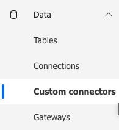
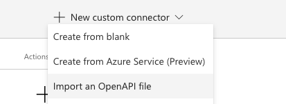
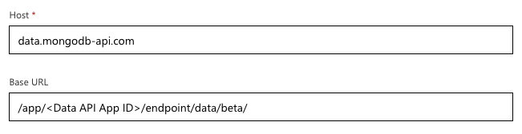

# MongoDB Azure Power Automate Custom connector

## MongoDB Data API
This connector is an introduction to the [MongoDB Data API](https://www.mongodb.com/data-api/l).   
The Data API provides you with a REST access to your data in [MongoDB Atlas](https://www.mongodb.com/atlas), the database-as-a-service offering by MongoDB.
You can find the full documentation on the MongoDB Data API on the [documentation website](https://docs.atlas.mongodb.com/api/data-api-resources/#data-api-resources).

## Getting Started
To test out the MongoDB Data API connector, start by [creating a MongoDB Atlas cluster](https://docs.atlas.mongodb.com/tutorial/).
Once you have a cluster, you can fork this connector.  
Once you have a cluster up and running, [enable the Data API](https://docs.atlas.mongodb.com/api/data-api/#1.-enable-the-data-api).   
From the Atlas UI, copy the URL endpoint provided for the Data API, and paste the value in your URL_ENDPOINT connector variable.    
Still in the Atlas UI, create a new API key, copy the value and paste it in the API_KEY connection variable.
You can now explore the various endpoints and see how to perform CRUD operations on your collection using the MongoDB Data API.

### Importing the connector
In the Power Automate portal, click on `Data -> Custom Connectors` in the menu on the left.  

Click on `+ New custom connector` in the top right menu and select `Import and OpenAPI file`

Select the `MongoDB-DataAPI-Sample.swagger.json` file from this repo.

Change the `baseURL` to reflect your environment. you can find your `<Data API App ID>`in the `Data API ` section of the MongoDB [Atlas console](https://cloud.mongodb.com).   

# Disclaimer

This is a sample custom connector.  
Use at your own risk; not a supported MongoDB product